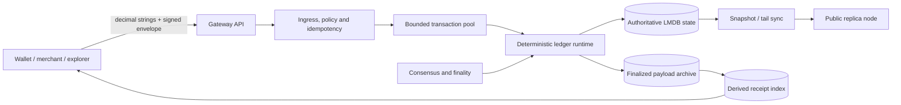
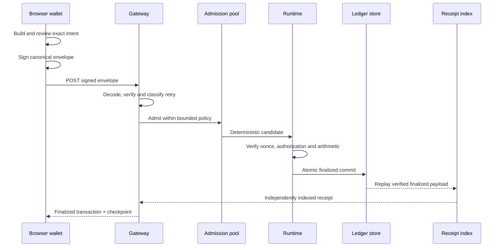

# Architecture

## System shape

Payrail is organized as a dependency-inverted payment platform. Domain crates
own invariants and state machines. Application crates coordinate them. Storage,
transport, cryptography and vendor integrations sit behind explicit ports.

The browser, API, receipt index and replica are presentations or derived views.
The finalized ledger state and verified transition history are authoritative.

## Layers

### Domain

`ledger-core`, `merchant-checkout-core`, `payment-idempotency-core`, membership,
finality and peer-health crates define typed states and invariants without HTTP,
LMDB or browser dependencies. Monetary values are checked integer atomic units.
State transitions validate completely before mutation.

### Application

`ledger-runtime-core`, `ledger-consensus-application`, `payment-gateway-core`,
payment ingress/reconciliation and block-production crates compose domain
operations. They preserve deterministic ordering, exact retries and
failure-atomic behavior.

### Infrastructure

LMDB adapters, filesystem journals, Ed25519 adapters, TLS transport and the
Axum gateway implement domain ports. An adapter may translate errors and
encodings; it must not create a second implementation of a domain invariant.

### Presentation

The typed TypeScript API client, exact-money package, browser wallet core and
Workstar applications are outside the ledger trust boundary. They never decide
balances, fees, acceptance or finality.

## Payment path

Publication or transport acknowledgement is not finality. Merchant fulfilment
requires a verified finalized receipt with an applied outcome.

## Monetary invariants

- Rust uses checked `u128` atomic units; browser code uses `bigint`.
- JSON carries canonical decimal strings, never floating-point money.
- Network ID, asset, sender, recipient, amount, fee, nonce, validity height and
  signer role are authorization-bound.
- Nonces are the consensus replay boundary; client idempotency keys are
  correlation and recovery boundaries.
- Batch and block execution are atomic: a rejected transition does not leak
  partial monetary state.
- Finalized receipts are derived from retained verified payloads and can be
  rebuilt without inventing ledger state.

## Finality and network status

The public development gateway currently reports `single-node-devnet`. The
repository also contains BFT foundations, proof boundaries, validator harnesses
and a Malachite adapter, but those components do not change the stated finality
of the public devnet. Production promotion requires authenticated validator-set
transitions, real finality certificates and the operational gates documented in
the ADRs.

## Persistence and recovery

The finalized ledger store atomically publishes normalized state, the state
commitment, finalized block payload and cursor. The receipt index is separate
and derived. Startup validates the durable network/configuration binding and
rebuilds missing derived receipts from retained finalized payloads. Snapshots
and tail sync accept data only after proof, hash, ordering and state-root checks.

## Related decisions

Start with [ADR-0003](ADR-0003-ledger-recovery-and-fee-sponsorship.md),
[ADR-0020](ADR-0020-canonical-ledger-block-execution.md),
[ADR-0025](ADR-0025-atomic-lmdb-authenticated-state.md),
[ADR-0030](ADR-0030-derived-finalized-receipt-index.md),
[ADR-0031](ADR-0031-journal-first-payment-idempotency.md) and
[ADR-0056](ADR-0056-ledger-consensus-application.md).
