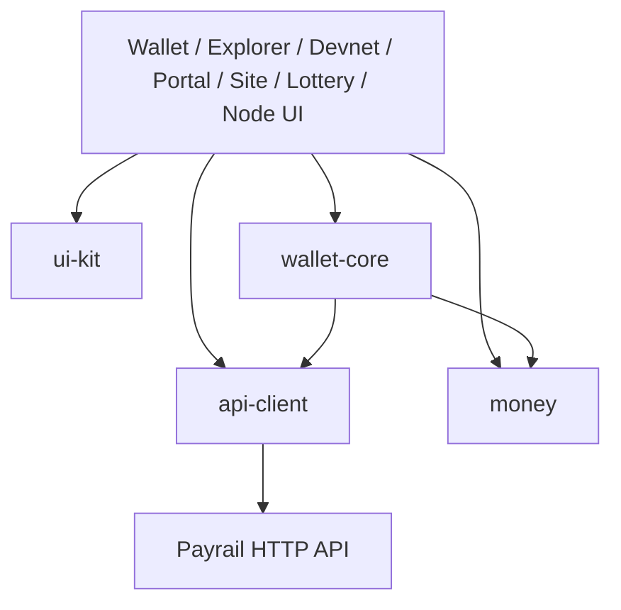

# Web applications

## Boundaries

The browser stack uses Workstar and TypeScript. It is a client of verified
ledger APIs, never the authority for balances, nonces, fees, finality or
monetary arithmetic.



Applications must consume these packages instead of copying address, amount,
envelope or signing logic.

## Shared packages

### `@platform/api-client`

Owns the current devnet JSON contract and canonical lowercase-hex conversion.
It returns string money/height/nonce fields without coercing them to JavaScript
`number`.

### `@platform/money`

Parses canonical positive decimal input into atomic `bigint` and formats atomic
values back to display strings. Asset decimals are explicitly bounded. The UI
may format for display, but only exact atomic values enter signing.

### `@platform/wallet-core`

Owns account/address derivation, canonical payment authorization, signed
envelopes and encrypted local vault handling. Signing remains in the browser.
Callers receive a wallet/session abstraction, not raw secret logging hooks.

### `@platform/ui-kit`

Owns shared Workstar primitives, design tokens and canonical public brand
assets. It has no authority over payment state.

## Applications

| App | Responsibility |
| --- | --- |
| `portal` | Combined merchant checkout and wallet reference flow for local E2E |
| `wallet` | Encrypted self-custody devnet wallet and signed payment review |
| `explorer` | Independent finalized-block, receipt and address presentation |
| `devnet` | Public development-network health/activity dashboard |
| `node` | Public replica-node status UI |
| `site` | Static product site; no wallet, signing or analytics authority |
| `lottery` | Auditable test-credit lottery and R1 settlement demonstration |

The lottery is a demonstration, not gambling or real-value issuance. Phone
numbers are not payment authorization. Production use would require custody,
fraud, SIM-swap, rate-limit and legal controls.

## Local commands

From `web/`:

```sh
npm ci
npm run check
npm run format:check
npm run build
npm run dev
```

Use the named scripts for individual apps, such as `npm run dev:wallet` or
`npm run dev:explorer`.

## Payment UI rules

- Show network and test-asset status near the action.
- Review recipient, asset, exact amount, fee and validity before signing.
- Keep decimal input separate from canonical atomic values.
- Treat submission timeouts as unknown, not rejected.
- Label a payment complete only after an independently indexed applied receipt.
- Label an expired finalized operation distinctly; it moved no value.
- Never include wallet secrets or sensitive request bodies in analytics,
  screenshots, traces or error reporting.

## End-to-end acceptance

The payment scenario creates independent browser wallets, funds through the
real devnet path, signs locally, submits the canonical envelope, waits for
finality, and verifies both wallet state and explorer/index evidence. Mocked
HTTP does not satisfy this acceptance gate.
